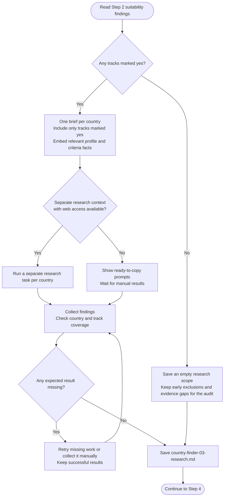

# Step 3: Research prompt generator



Collect detailed research for each country's eligible tracks.

## Flow

```mermaid
flowchart TD
  Start(["Read Step 2 suitability findings"]) --> Eligible{"Any tracks marked yes?"}
  Eligible -->|No| Empty["Save an empty research scope<br/>Keep early exclusions and evidence gaps for the audit"]
  Eligible -->|Yes| Brief["One brief per country<br/>Include only tracks marked yes<br/>Embed relevant profile and criteria facts"]
  Brief --> Cap{"Separate research context<br/>with web access available?"}
  Cap -->|Yes| Tasks["Run a separate research task per country"]
  Cap -->|No| Manual["Show ready-to-copy prompts<br/>Wait for manual results"]
  Tasks --> Collect["Collect findings<br/>Check country and track coverage"]
  Manual --> Collect
  Collect --> Missing{"Any expected result missing?"}
  Missing -->|Yes| Resolve["Retry missing work or collect it manually<br/>Keep successful results"]
  Resolve --> Collect
  Missing -->|No| Save["Save country-finder-03-research.md"]
  Empty --> Save
  Save --> Next(["Continue to Step 4"])
```

## Complete procedure

{{ page.guide_source | guide_full }}
