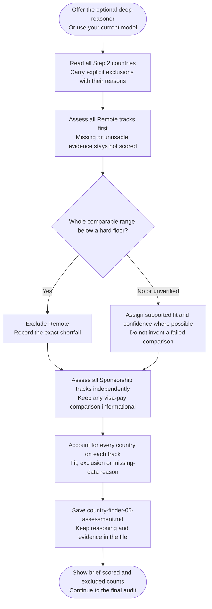

# Step 5: Scoring



Assess Remote and Sponsorship separately using categorical fits and confidence, without numerical scores.

## Flow

```mermaid
flowchart TD
  Start(["Offer the optional deep-reasoner<br/>Or use your current model"]) --> Carry["Read all Step 2 countries<br/>Carry explicit exclusions with their reasons"]
  Carry --> Remote["Assess all Remote tracks first<br/>Missing or unusable evidence stays not scored"]
  Remote --> Floor{"Whole comparable range below a hard floor?"}
  Floor -->|Yes| Exclude["Exclude Remote<br/>Record the exact shortfall"]
  Floor -->|No or unverified| Fit["Assign supported fit and confidence where possible<br/>Do not invent a failed comparison"]
  Exclude --> Sponsorship["Assess all Sponsorship tracks independently<br/>Keep any visa-pay comparison informational"]
  Fit --> Sponsorship
  Sponsorship --> Coverage["Account for every country on each track<br/>Fit, exclusion or missing-data reason"]
  Coverage --> Save["Save country-finder-05-assessment.md<br/>Keep reasoning and evidence in the file"]
  Save --> Next(["Show brief scored and excluded counts<br/>Continue to the final audit"])
```

## Complete procedure

{{ page.guide_source | guide_full }}
