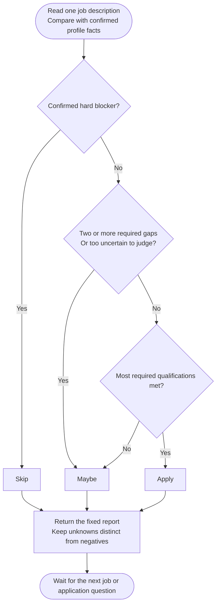

# Step 1: Match analysis



Compare one job with confirmed profile facts, keeping unknowns distinct from failures.

## Flow

```mermaid
flowchart TD
  Start(["Read one job description<br/>Compare with confirmed profile facts"]) --> Block{"Confirmed hard blocker?"}
  Block -->|Yes| Skip["Skip"]
  Block -->|No| Gaps{"Two or more required gaps<br/>Or too uncertain to judge?"}
  Gaps -->|Yes| Maybe["Maybe"]
  Gaps -->|No| Most{"Most required qualifications met?"}
  Most -->|Yes| Apply["Apply"]
  Most -->|No| Maybe
  Skip --> Report["Return the fixed report<br/>Keep unknowns distinct from negatives"]
  Maybe --> Report
  Apply --> Report
  Report --> Wait(["Wait for the next job or application question"])
```

## Complete procedure

{{ page.guide_source | guide_full }}
