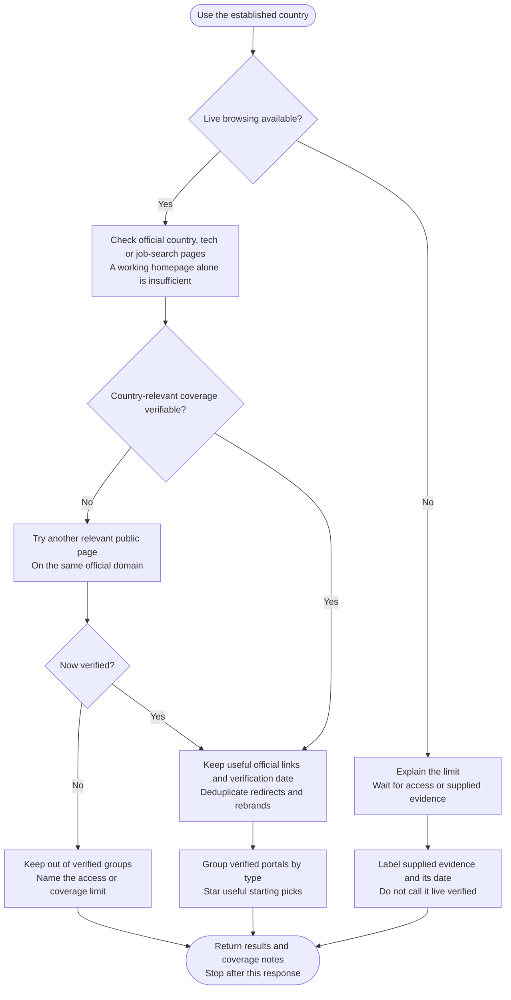

# Step 1: Portal research



Verify portals on their own sites for the chosen country's IT/tech roles.

## Flow

```mermaid
flowchart TD
  Start(["Use the established country"]) --> Browse{"Live browsing available?"}
  Browse -->|No| Wait["Explain the limit<br/>Wait for access or supplied evidence"]
  Wait --> Supplied["Label supplied evidence and its date<br/>Do not call it live verified"]
  Browse -->|Yes| Check["Check official country, tech or job-search pages<br/>A working homepage alone is insufficient"]
  Check --> Access{"Country-relevant coverage verifiable?"}
  Access -->|No| Retry["Try another relevant public page<br/>On the same official domain"]
  Retry --> Verified{"Now verified?"}
  Verified -->|No| Note["Keep out of verified groups<br/>Name the access or coverage limit"]
  Verified -->|Yes| Keep
  Access -->|Yes| Keep["Keep useful official links and verification date<br/>Deduplicate redirects and rebrands"]
  Keep --> Group["Group verified portals by type<br/>Star useful starting picks"]
  Note --> Result
  Group --> Result(["Return results and coverage notes<br/>Stop after this response"])
  Supplied --> Result
```

## Complete procedure

{{ page.guide_source | guide_full }}
