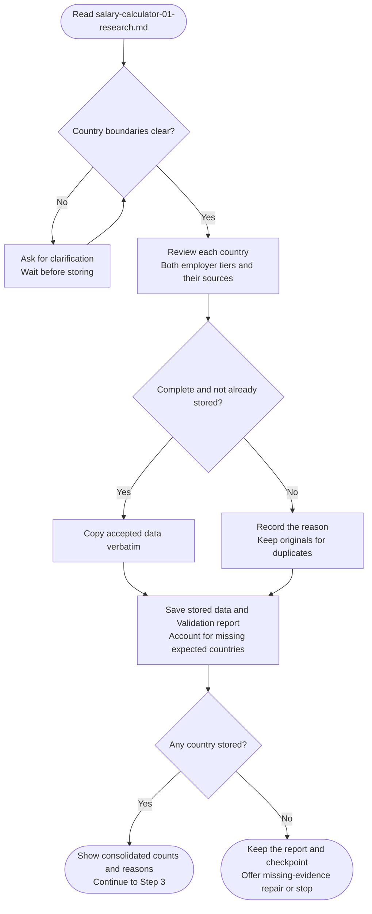

# Step 2: Data validation



Store accepted salary research unchanged, without verifying market claims or calculating targets.

## Flow

```mermaid
flowchart TD
  Start(["Read salary-calculator-01-research.md"]) --> Bounds{"Country boundaries clear?"}
  Bounds -->|No| Ask["Ask for clarification<br/>Wait before storing"]
  Ask --> Bounds
  Bounds -->|Yes| Review["Review each country<br/>Both employer tiers and their sources"]
  Review --> Accept{"Complete and not already stored?"}
  Accept -->|Yes| Store["Copy accepted data verbatim"]
  Accept -->|No| Skip["Record the reason<br/>Keep originals for duplicates"]
  Store --> Save["Save stored data and Validation report<br/>Account for missing expected countries"]
  Skip --> Save
  Save --> Usable{"Any country stored?"}
  Usable -->|Yes| Next(["Show consolidated counts and reasons<br/>Continue to Step 3"])
  Usable -->|No| Repair(["Keep the report and checkpoint<br/>Offer missing-evidence repair or stop"])
```

## Complete procedure

{{ page.guide_source | guide_full }}
